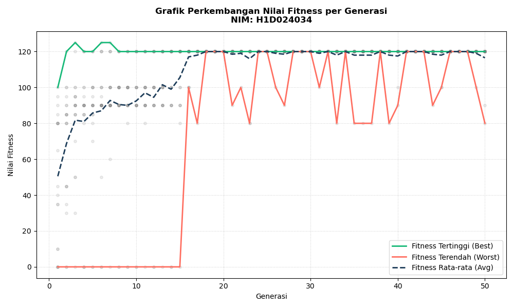

# Pertemuan 10 - Algoritma Genetika (Knapsack Problem)

**Nama:** Fauzan Malik Arkan  
**NIM:** H1D024036

## Deskripsi

Program Algoritma Genetika buat menyelesaikan masalah Knapsack (optimasi gudang). Tujuannya mencari kombinasi barang dengan keuntungan paling tinggi tanpa melebihi kapasitas gudang.

## Data Barang

| No | Nama     | Keuntungan | Ukuran |
|----|----------|------------|--------|
| 1  | Barang 1 | 10         | 5      |
| 2  | Barang 2 | 40         | 4      |
| 3  | Barang 3 | 30         | 6      |
| 4  | Barang 4 | 50         | 3      |
| 5  | Barang 5 | 35         | 7      |

**Kapasitas Gudang:** 15

## Parameter GA

| Parameter          | Nilai |
|--------------------|-------|
| Jumlah Generasi    | 50    |
| Jumlah Populasi    | 20    |
| Prob. Crossover    | 0.8   |
| Prob. Mutasi       | 0.15  |
| Kapasitas Gudang   | 15    |

## Metode yang Dipakai

- **Seleksi:** Tournament Selection (k=3)
- **Crossover:** Two-Point Crossover
- **Mutasi:** Inversion Mutation

## Penjelasan File

- `InisiasiPopulasi.py` - buat populasi awal random (kromosom biner 0/1)
- `EvaluasiFitness.py` - hitung fitness, kalo bobot > kapasitas fitness = 0
- `selection.py` - seleksi parent pake Roulette Wheel & Tournament
- `crossover.py` - crossover (One-Point, Two-Point, Uniform)
- `mutation.py` - mutasi (Swap, Inversion, Uniform/Bit-Flip)
- `main.py` - program utama yg jalanin semua proses GA

## Cara Jalankan

```bash
python main.py
```

Tiap modul juga bisa dijalankan sendiri:

```bash
python InisiasiPopulasi.py
python EvaluasiFitness.py
python selection.py
python crossover.py
python mutation.py
```

## Output

### Grafik Fitness



- Hijau = Fitness tertinggi
- Merah = Fitness terendah
- Biru gelap = Fitness rata-rata

### Contoh Hasil

```
Kromosom Terbaik     : [0, 1, 0, 1, 1]
Total Keuntungan     : 125
Total Ukuran/Bobot   : 14 (Kapasitas: 15)

Daftar Barang Terpilih:
  [v] Barang 2 (Keuntungan: 40, Ukuran: 4)
  [v] Barang 4 (Keuntungan: 50, Ukuran: 3)
  [v] Barang 5 (Keuntungan: 35, Ukuran: 7)
```

## Dependensi

- Python 3.x
- matplotlib

```bash
pip install matplotlib
```
